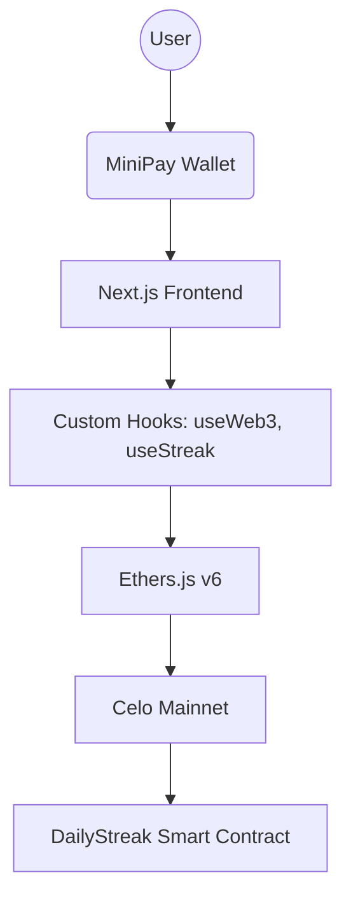

# 🛠️ Developer Documentation

Welcome to the internal developer guide for MiniPay Streak. This document provides technical insights into the codebase, architecture, and development workflows.

## 📁 Repository Structure

- `/src/app`: Next.js App Router pages and layouts.
- `/src/components`: UI components, layout elements, and feature-specific components.
- `/src/hooks`: Custom React hooks for Web3, state, and utility logic.
- `/src/utils`: Helper functions for formatting, validation, and blockchain interaction.
- `/contracts`: Smart contract ABIs and documentation.

## 🏗️ Application Architecture

## 💾 State Management
    
Our application utilizes a multi-layered state management strategy:

1. **Local React State**: For ephemeral UI interactions (modals, tooltips, loading indicators).
2. **Persistent Local Storage**: Via `useLocalStorage`, we persist non-sensitive user preferences and cached chain data to minimize RPC calls.
3. **Onchain State**: The single source of truth for streak data, managed through `ethers.js` providers and signers.
## ⛓️ Web3 Integration

We interface with Celo using Ethers.js v6. Key considerations:

- **Provider**: We prioritize `window.ethereum` if `isMiniPay` is true.
- **Gas**: For MiniPay users, we leverage gas abstraction. For others, we ensure efficient gas estimation.
- **ABIs**: All contract interfaces are stored in `/contracts/ABI.json`.
## 🚀 Getting Started

1. **Install Dependencies**: `npm install`
2. **Local Development**: `npm run dev`
3. **Linting**: `npm run lint`
4. **Build**: `npm run build`

---

*Last Updated: April 2026*
